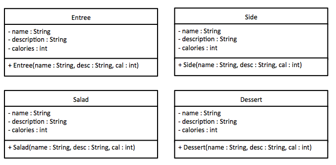
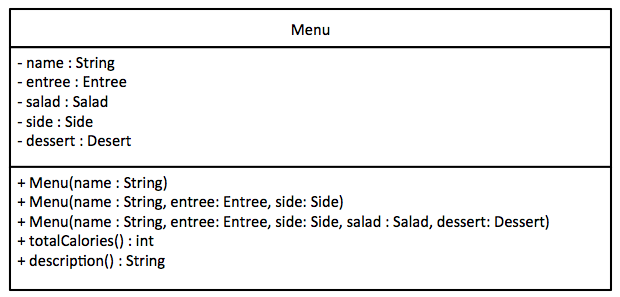
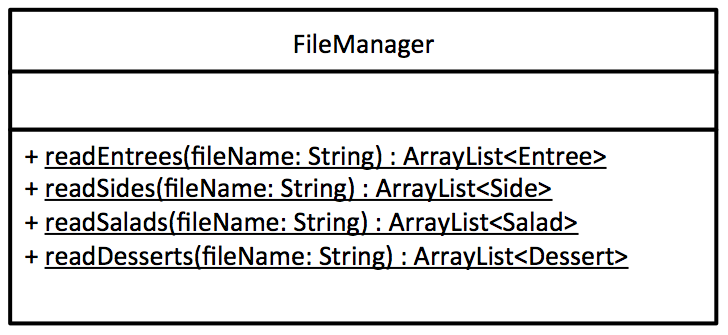
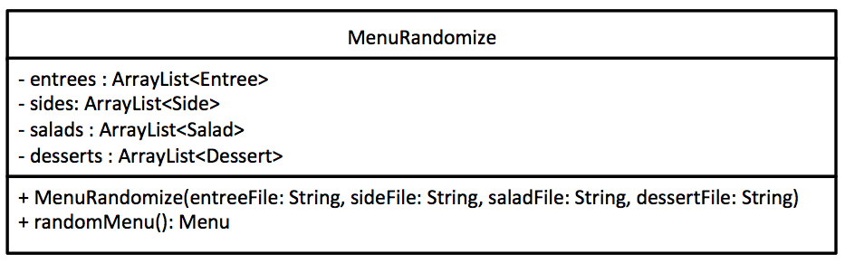
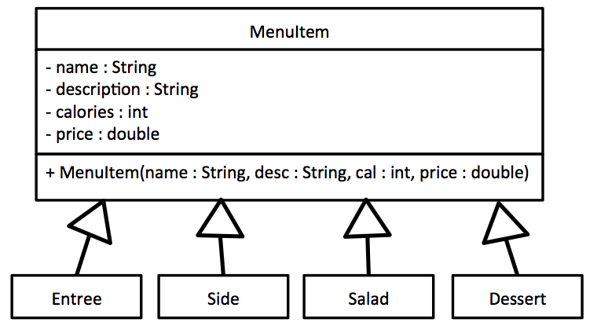
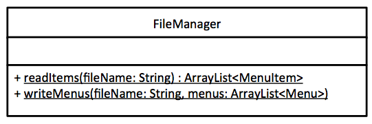
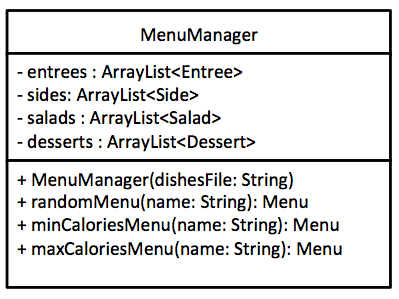
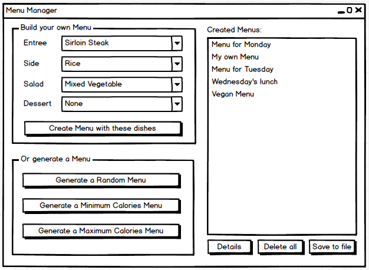
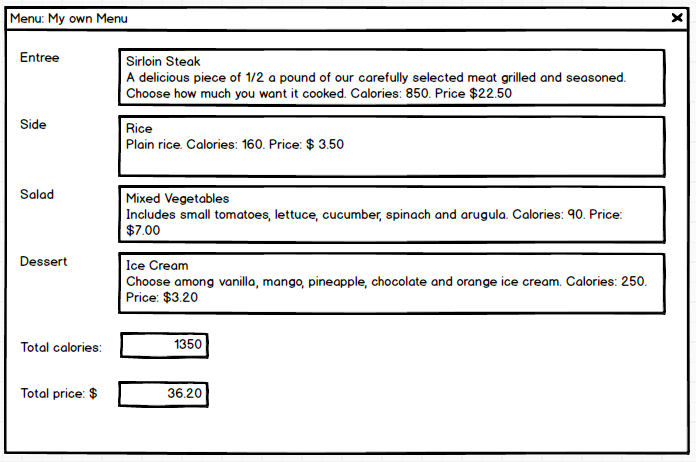

## Pitt Java (INFSCI 0017) assignments and labs

- **Assignment 1:**

  - Create 5 classes: Entree, Side, Salad, Dessert, and Menu by the class diagrams
  
  
  
  
  
  - Getters and Setters are not shown in the class diagrams but should be included
  
  - Create another class MenuTest with a main method to test the Menu class

- **Assignment 2:**

  - Create 2 classes: FileManager and MenuRandomize by the class diagrams
  
  
  
  
  
  - FileManager has methods for reading different types of dishes (Entree, Side, Salad, Dessert) from different files and returning an ArrayList of each type of dishes
  
  - MenuRandomize constructor receives the file names of 4 files, one for each type of meal, and uses FileManager to load data from these text files into the 4 ArrayList declared as properties (one array for each type of dish). The method randomMenu() randomly pick one Entree, one Side, one Salad and one Dessert, and return a Menu object composed of the random dishes.
  
  - All files should follow the same format: name of dish@@description of the dish@@calories
  
  - Check your classes with the following Tester class:
  
    ```java
    public class MenuTester{
      public static void main(String[] args){
        MenuRandomize randomize = new MenuRandomize("data/entrees.txt", "data/sides.txt",
                                                    "data/salads.txt", "data/desserts.txt");
        Menu myMenu = randomize.randomMenu();
        System.out.println(myMenu.description() + "\nTotal calories" + myMenu.totalCalories());
      }
    }
    ```

- **Assignment 3:**

  - Create 2 classes: MenuItem and MenuManager and modify FileManager by the class diagrams
  
  
  
  
  
  
  
  - MenuItem is defined as the superclass for Entree, Side, Salad and Dessert (all these 4 classes extend MenuItem)
  
  - FileManager now reads all types of dishes from a single file in which each line can be an entree, a side, a salad or a dessert
  
  - MenuManager has an ArrayList of each of the type of dishes (like MenuRandomize in Assignment 2). Now we need to separate the single ArrayList containing MenuItem objects into the four ArrayList of different types. Hint: ```instanceof``` operator

- **Assignment 4 - Final Project:**

  - Create the final class: MenuManagerGUI which contains all graphic components and a MenuManager object
  
  
  
  

---

- **Lab 1:** Installation

- **Lab 2:** Pythagorean Theorem, Area and Perimeter, Decomponsing Money

- **Lab 3:** Unit Converter

- **Lab 4:** Logarithm Calculator

- **Lab 5:** 2 Dice Roller

- **Lab 6:** MyRectangle Class

- **Lab 7:** Multi Dices Roller

- **Lab 8:** EMR Classes and Objects

- **Lab 9:** Linked Lists and File IO

- **Lab 10:** Inheritance, Subclass, Superclass, and Abstract Class

- **Lab 11:** Calculator GUI

- **Lab 12:** Recursion

- **Lab 13:** Polymorphism and Interface
