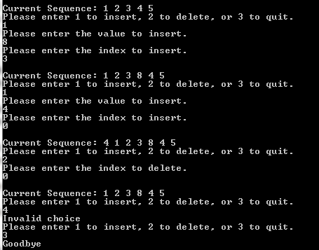
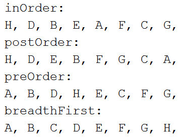
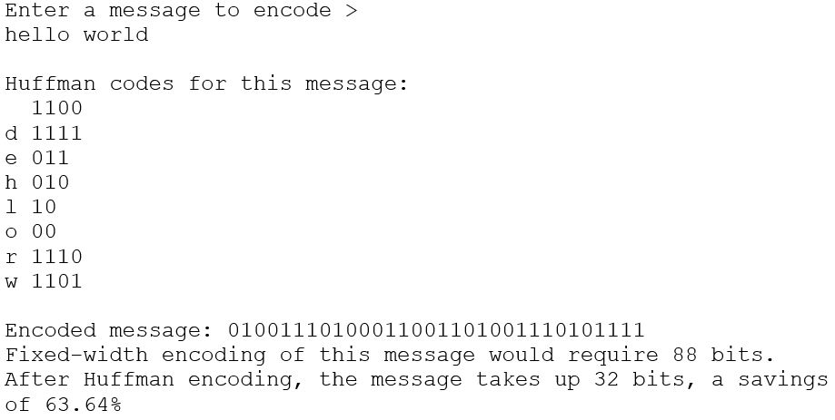

## Pitt Data Structures (INFSCI 2500) assignments 

- **Assignement 1:**

  - Computes all prime numbers from 2 to n where n starts at 10,000 and goes to 100,000 in steps of 10,000
  
  - Show prime numbers and the needed time
  
    

- **Assignment 2:**

  - Insert or delete from a sequence
  
    

- **Assignment 3:**

  - Compares the performance of ArrayLists and LinkedLists
  
    

- **Assignment 4:**

  - Implements the methods: In Order, Post Order, Pre Order, and Breadth First
  
    

- **Assignment 5:**

  - Radix Sort

- **Assignment 6:**

  - Huffman Code
  
    
